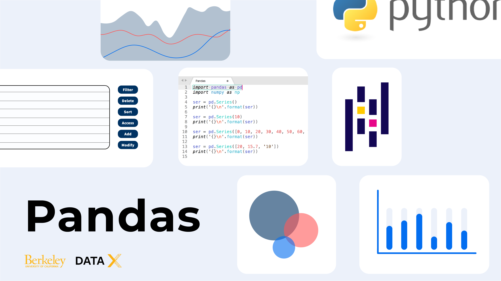
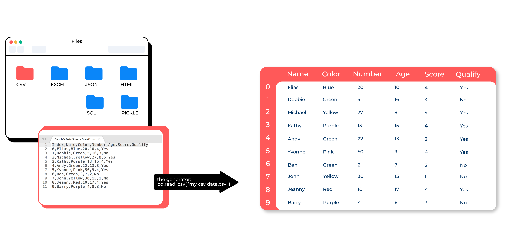

     
     
# **DATA-X:**    m120 - INTRODUCTION TO DATA ANALYSIS USING PANDAS

 

 

**Author List (in no particular order):** [Priya Kamdar](www.linkedin.com/in/priya-kamdar), [Alexander Fred-Ojala](https://www.linkedin.com/in/alexanderfo/), [Ikhlaq Sidhu](https://ikhlaq-sidhu.com/), [Elias Castro Hernandez](https://www.linkedin.com/in/ehcastroh/), and [Debbie Yuen](http://www.debbiecyuen.me/) 

**About (TL/DR):** Pandas is a commonly used, yet powerful, software library written for Python that is built for expedient data manipulation and analysis. 

**Learning Goal(s):** This notebook aims to introduce the syntax, data structures, and manipulation operations commonly seen in Pandas.

**Associated Materials:** None

**Keywords (Tags):** data-science, data-analysis, pandas, pandas-tutorial, pandas-python, statistical-analysis, numerical-analysis, data-x 

**Prerequisite Knowledge:** (1) Python, (2) NumPy 

**Target User:** Data scientists, applied machine learning engineers, and developers

**Copyright:** Content curation has been used to expedite the creation of the following learning materials. Credit and copyright belong to the content creators used in facilitating this content. Please support the creators of the resources used by frequenting their sites, and social media.

     
### **CONTENT**   

  - m120_Intro_data_analysis_using_pandas -- Pandas data structures and data manipulation.
  - assets/homeworks/   -- Contains several exercises to help you master the material.

#### **I. DATAFRAME CREATION**

     
    1) PART 1.1: PANDAS DATAFRAME
    2) PART 1.2: DATAFRAME CREATION
    3) PART 1.3: ACCESSING DATAFRAME
    
#### **II. READ-IN AND EXPLORE DATA USING DATAFRAMES**

     
    1) PART 2.1: READ DATA INTO DATAFRAMES
    2) PART 2.2: WRITING DATA TO CSV
    3) PART 2.3 (OPTIONAL): READ AND WRITE EXCEL FILES

    
#### **III. WRAP UP AND NEXT STEPS**

Now that you're familiar with how to use Pandas,there is much more than can be done. Visit the [**Data-X website**](https://datax.berkeley.edu/) to learn how to use Pandas in areas such a pipeline creation, data visualization, or use the following links to curated topics of interest:

> [INTRODUCTION TO NUMERICAL ANALSYS USING NUMPY (m110): url needed]() Covers numerical analysis using NumPy.

> [INTRODUCTION TO DATA VISUALIZATION USING MATPLOTLIB + SEABORN (m130): url needed]() Covers the process of using DataFrames to create engaging visualizations  

> [SYNTHETIC DATA GENERATION USING PANDAS (m190): url needed]() Covers data augmentation (creating statistically valid data), and data correction (using ML to fill-in missing data)

