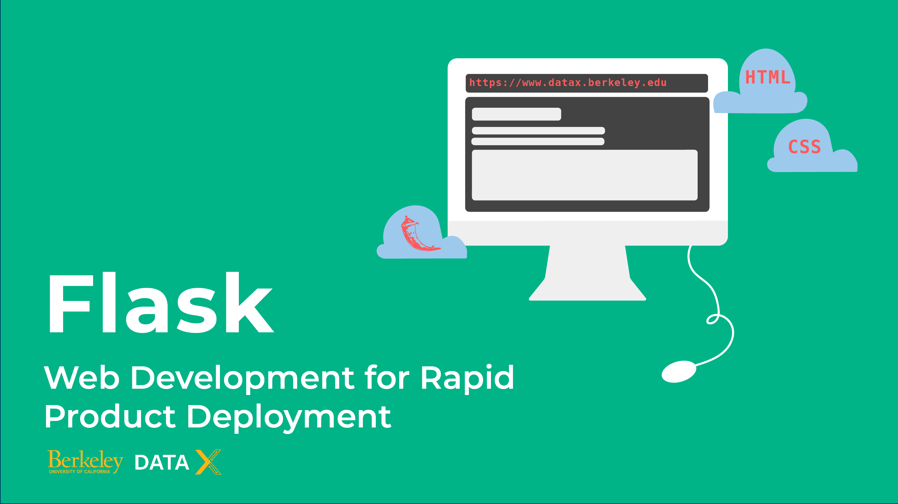
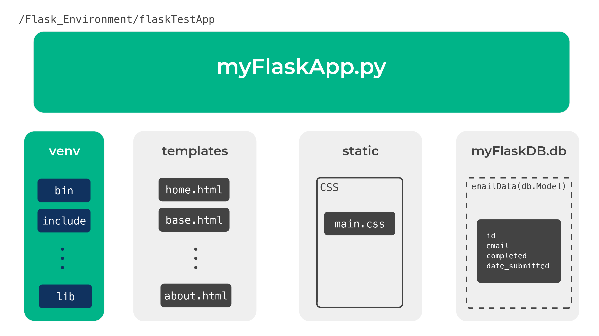
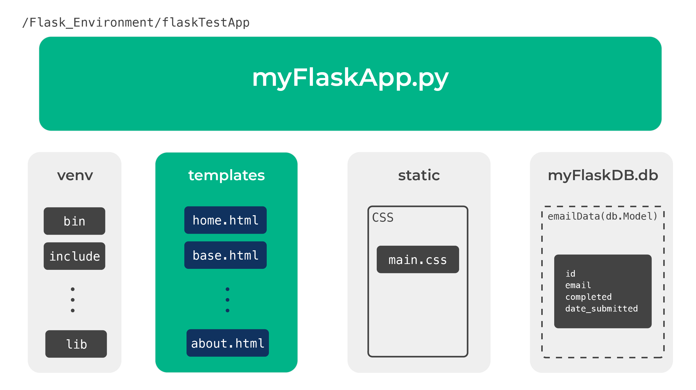
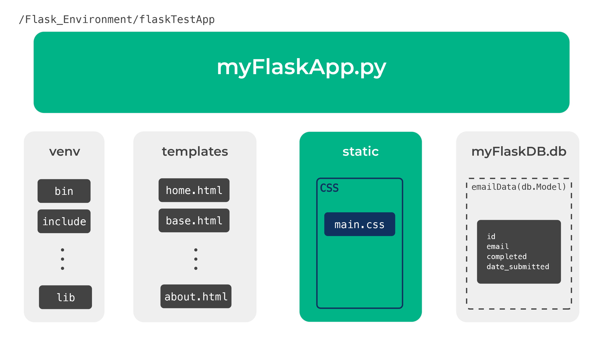
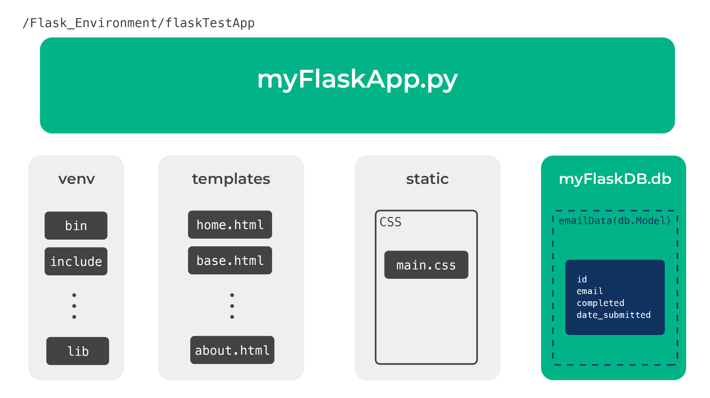

     
     
# **DATA-X:**    m320 - FLASK - EASY WEB DEVELOPMENT FOR RAPID DEPLOYMENT.

 

 

**Author List (in no particular order):** [Ikhlaq Sidhu](https://ikhlaq-sidhu.com/), [Elias Castro Hernandez](https://www.linkedin.com/in/ehcastroh/), and [Debbie Yuen](http://www.debbiecyuen.me/) 

**About (TL/DR):** The following collection of notebooks introduces developers and data scientists to web development using Flask. Flask is one of many available web server gateway interface (WSGI) tools that enable rapid and scalable websites and apps with a relatively accessible learning curve. The barebones capacity of Flask is particularly valuable when prototyping and iterating upon products, services, and machine learning applications.

**Learning Goal(s):** Gain an understanding of how to utilize available libraries and packages to quickly build products and services -- in real-life settings, using web-first methodology, driven by data, and end-to-end. In particular, learn how to build a bare-bones flask environment that can then be repurposed to (1) handle email automation tasks, (2) deploy ML models in real-time, and (3) create engaging dashboards using D3.js.

**Associated Materials:** None

**Keywords (Tags):** data-x, flask, flask-sqlalchemy, flask-web, flask-application, website, webapp, web-app 

**Prerequisite Knowledge:** (1) Python, (2) HTML, and (3) CSS

**Target User:** Data scientists, applied machine learning engineers, and developers

**Copyright:** Content curation has been used to expedite the creation of the following learning materials. Credit and copyright belong to the content creators used in facilitating this content. Please support the creators of the resources used by frequenting their sites, and social media.

     
### **CONTENT**   

  - m320_Setting_up_Flask -- Fundamental overview of creating a Flask website.
  - assets/homeworks/   -- Contains several exercises to help you master the material.

#### **I. SETTING UP A FLASK ENVIRONMENT**
     
    1) FLASK SETUP AND WORKFLOW
 
     
    2) BASIC FLASK UP-AND-RUNNING

#### **II. DESIGN, BEHAVIORS, AND STORAGE**

     
    1) SET UP NESTED DIRECTORIES AND FILES

     
    2) SET BASIC HTML & CSS
    

     
    3) LINK FLASK TO SQLITE
    4) (OPTIONAL): IMPLEMENT MYSQL DATABASE AND SERVER ENVIRONMENT
    
    
#### **III. WRAP UP AND NEXT STEPS**

Now that you've learned how to deploy a Flask environment,there is much more than can be done using Flask. Visit the [Data-X website](https://datax.berkeley.edu/) to learn how to link Flask to other services, or use the following links to curated topics of interest:

> [**Emails With Flask + SMTPLIB: url needed**]() Capitalizes on Flask's barebones architecture to create a lightweight email client using SMTPLIB

> [**Linking AWS With FLASK: url needed**]() Shows you how to deploy your Flask environment in an elastic server

> [**Dashboards Using D3.js + Flask: url needed**]() Covers how to deploy a dashboard Flask website with dynamic plots using D3.js

> [**Productionized Machine Learning Models Using Flask: : url needed**]() Introduces how to deploy machine learning models that are accessible via the web

